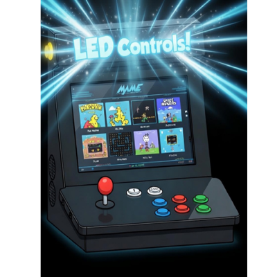

# RetroPie / Batocera LED Controller

Control WS2812B LED strips on a Raspberry Pi 5 via SPI — designed for arcade cabinets.
Supports both **RetroPie** and **Batocera** from a single repository.



---

## Features

- **RetroLED** — graphical pygame UI with an arcade BIOS boot sequence, virtual LED strip synced live to your physical LEDs, and joystick navigation
- **8 animations:** KITT scanner, Glow pulse, Center pulse, Meteor shower, Twinkle sparkles, Color cycle, Rainbow wave, Off
- **9 colors:** Red, orange, yellow, green, cyan, blue, purple, pink, white
- **Per-system animations** — different LEDs for MAME, NES, SNES, N64, and more
- **Per-ROM overrides** — specific games can have their own animation and color
- **Live WebSocket sync** — RetroLED shows the exact pixel state of your physical strip in real time
- **Flip strip** — reverse the virtual display to match however your strip is physically installed
- **Persistent config** via `ledcontrol.toml` — all settings survive reboots
- **Auto-starts on boot**, clears LEDs cleanly on shutdown

---

## How It Works

```
LEDControl.py (background service)
  ├── Drives physical WS2812B LEDs via SPI
  ├── Runs animations in a loop
  └── WebSocket server on ws://127.0.0.1:8765
        ├── Streams pixel state ~60fps → RetroLED virtual strip
        └── Accepts commands → switches animation instantly

RetroLED (Ports menu → pygame UI)
  ├── Connects to service WebSocket
  ├── Shows virtual LED strip synced to physical LEDs
  └── Set animation / color / brightness / flip — saves to config

Game hooks (runcommand / gameStart)
  └── Send WebSocket command to service when game launches/exits
        → service stays running, no process juggling
```

---

## Requirements

| | RetroPie | Batocera |
|---|---|---|
| Hardware | Raspberry Pi 5 | Raspberry Pi 5 |
| Python | 3.11+ | 3.12 (built-in) |
| LED library | `rpi5-ws2812` (installed by script) | `adafruit-blinka` + `neopixel-spi` (installed by script) |
| Pygame | `python3-pygame` (installed by script) | Built-in |
| Service manager | systemd | batocera-services |

---

## Wiring

| LED wire | Connect to |
|---|---|
| Data In | GPIO 10 (MOSI, physical pin 19) |
| GND | Any Pi GND pin |
| 5V | External 5V supply (shared GND with Pi) |

**Recommended:** 330–470Ω resistor in series on the data line. 1000µF capacitor across 5V/GND at the strip.

### Power

Each WS2812B draws up to **60mA at full white**. At the default 80% brightness limit, ~48mA per LED.

| LEDs | Peak current (80%) |
|------|-------------------|
| 14 (default) | ~672mA |
| 20 | ~960mA |
| 30+ | Requires dedicated 5V supply |

---

## Installation — RetroPie

> **Building a whole cabinet from a blank Pi?** Use **`picadeinstall.sh`**, the
> one-command installer that does RetroPie, this LED software, box hardening, and
> (optionally) USB audio together — see **[docs/BUILD.md](docs/BUILD.md)**. The
> steps below are for adding the **LED software only** to an existing RetroPie.

SSH into your Pi:

```bash
cd ~
git clone https://github.com/belcht/RetroPie-LED-Controller.git LEDControl
cd LEDControl
bash install.sh
```

The installer:
1. Creates a Python virtual environment and installs `rpi5-ws2812`
2. Enables SPI
3. Installs and enables systemd services (auto-start + shutdown cleanup)
4. Installs RunCommand hooks for per-game LED reactions
5. Installs pygame
6. Adds **RetroLED** to the EmulationStation Ports menu with cover art

Restart EmulationStation after installation.

---

## Installation — Batocera

### Option A — Directly on the Batocera machine

```bash
ssh root@bat1.local
cd /userdata/system
wget https://github.com/belcht/RetroPie-LED-Controller/archive/refs/heads/main.zip -O led.zip
unzip led.zip
mv RetroPie-LED-Controller-main LEDControl
cd LEDControl
bash batocera/install.sh
```

### Option B — Deploy from Mac/Linux (recommended for development)

```bash
# Clone on your Mac/Linux machine
git clone https://github.com/belcht/RetroPie-LED-Controller.git
cd RetroPie-LED-Controller

# Set up passwordless SSH (first time only)
ssh-copy-id pi@pivert.local      # RetroPie
ssh-copy-id root@bat1.local      # Batocera

# Deploy and install
bash deploy.sh pivert.local               # RetroPie
bash deploy.sh batocera bat1.local        # Batocera
bash deploy.sh pivert.local --sync-only   # files only, skip install
```

### Option C — Windows via network share

1. Open `\\bat1.local` in File Explorer
2. Copy the repo folder to `share\system\LEDControl\`
3. SSH in and run `bash /userdata/system/LEDControl/batocera/install.sh`

---

## RetroLED — the UI

Launch **RetroLED** from the Ports section of EmulationStation.

On launch you'll see an arcade BIOS boot sequence, then a splash screen. Press **Start** or **A** to enter the main menu.

### Menu

| Option | Controls |
|--------|----------|
| **SET ANIMATION** | Select to open list — up/down to browse (live preview on physical LEDs), Select to save |
| **SET COLOR** | Select to open list — up/down to browse (live preview), Select to save |
| **BRIGHTNESS** | Left/Right to adjust in 5% steps |
| **FLIP STRIP** | Select to toggle — reverses virtual display to match physical installation direction |
| **PER-SYSTEM** | Select to open the per-system editor (see below) |
| **LEDS OFF** | Select to turn off immediately |
| **EXIT** | Returns to EmulationStation |

Scrolling through animations and colors shows a live preview on your physical LEDs. Only **Select** saves the choice. **SET ANIMATION**, **SET COLOR**, and **BRIGHTNESS** set the **global default** (the `[general]` section of `ledcontrol.toml`).

### Per-system animations (in the UI)

**PER-SYSTEM** lists every system EmulationStation knows about (from `es_systems.cfg`). Select a system to give it its own animation + color when you launch its games:

- **SET ANIMATION** / **SET COLOR** — same pickers as the main menu, but saved to just that system (`[systems].<name>`), with a live preview as you browse.
- **USE DEFAULT** — removes that system's override so it follows the global default again.

Each row shows the system's current setting, or `(default)` if it has none. Saved choices write to `[systems]` in `ledcontrol.toml` (you can still hand-edit that section — see [Configuration](#configuration)); the running service picks them up immediately and the per-game LED reaction uses them on the next game launch.

### Joystick buttons

Default button mapping covers most arcade controllers. If your buttons don't respond, check `[ui]` in `ledcontrol.toml`:

```toml
[ui]
btn_select = [0, 2, 9, 11]   # button numbers that act as SELECT / A / Start
btn_back   = [1, 3, 8, 10]   # button numbers that act as BACK / B
```

Adjust the numbers to match your controller's button layout.

---

## Configuration

**RetroPie:** `/home/pi/ledcontrol.toml`
**Batocera:** `/userdata/system/ledcontrol.toml`

```toml
[hardware]
num_leds = 14       # number of LEDs in your strip
spi_bus = 0
spi_device = 0

[general]
global_brightness = 0.8    # 0.0–1.0
default_animate = "kitt"
default_color = "red"
flip_strip = false          # true if your strip is installed right-to-left

[ui]
btn_select = [0, 2, 9, 11]  # joystick buttons for SELECT
btn_back   = [1, 3, 8, 10]  # joystick buttons for BACK

[kitt]
tail_length = 6
base_speed = 0.04

[glow]
min_brightness = 0.5
max_brightness = 1.0
duration = 1.0

[cycle]
cycle_duration = 10.0
fade_time = 1.5
fade_enabled = true

[rainbow]
speed = 0.02

[meteor]
tail_length = 8
speed = 0.05

[twinkle]
num_sparkles = 5
fade_speed = 0.04

# Per-system animations
[systems]
default   = { animate = "kitt",    color = "red" }
arcade    = { animate = "kitt",    color = "red" }
nes       = { animate = "glow",    color = "white" }
snes      = { animate = "glow",    color = "purple" }
megadrive = { animate = "meteor",  color = "blue" }
genesis   = { animate = "meteor",  color = "blue" }
n64       = { animate = "rainbow" }
psx       = { animate = "glow",    color = "cyan" }
gb        = { animate = "glow",    color = "green" }
pc        = { animate = "twinkle", color = "white" }

# Per-ROM overrides (filename without extension, case-insensitive)
[roms]
# "Street Fighter II" = { animate = "kitt", color = "red" }
# "Sonic the Hedgehog" = { animate = "meteor", color = "blue" }
```

### Animations

| Name | Description |
|---|---|
| `kitt` | KITT scanner — bouncing dot with tail |
| `glow` | Breathing pulse — strip fades in and out |
| `centerpulse` | Expands from center outward, collapses back |
| `meteor` | Comet streaks across the strip |
| `twinkle` | Random sparkles fading in and out |
| `cycle` | Cross-fades through colors |
| `rainbow` | Rainbow wave scrolling across the strip |
| `off` | LEDs off |

### Restart service after editing config

**RetroPie:**
```bash
sudo systemctl restart ledcontrol.service
```

**Batocera:**
```bash
batocera-services stop ledcontrol && batocera-services start ledcontrol
```

---

## Per-Game LED Reactions

When a game launches, the service automatically switches to the animation configured for that system or ROM in `ledcontrol.toml`. When the game exits, the default animation resumes. No extra setup needed — the hooks are installed automatically.

To send a command manually:

```bash
# RetroPie
python3 /home/pi/LEDControl/led-ws-cmd.py --animate rainbow --color blue

# Batocera
python3 /userdata/system/LEDControl/led-ws-cmd.py --restore
```

---

## Troubleshooting

### RetroPie

| Symptom | Fix |
|---|---|
| LEDs stay on after reboot | `journalctl -u leds-off.service` |
| No LEDs at all | Check SPI: `lsmod \| grep spi`. Check wiring and 5V supply |
| Service won't start | `sudo systemctl status ledcontrol.service` |
| RetroLED not in Ports | Re-run `bash install.sh`, restart EmulationStation |
| Multiple animations fighting | `sudo systemctl restart ledcontrol.service` |

### Batocera

| Symptom | Fix |
|---|---|
| No LEDs at all | Check `/userdata/system/config.txt` for `dtparam=spi=on` — reboot required |
| Service won't start | `batocera-services start ledcontrol` — check for Python errors |
| RetroLED shows blank/white screen | Launcher missing `export DISPLAY=:0` — re-run `bash batocera/install.sh` |
| Buttons don't respond in RetroLED | Adjust `btn_select` / `btn_back` in `ledcontrol.toml` |
| Animation doesn't change on game launch | Check WebSocket: `python3 /userdata/system/LEDControl/led-ws-cmd.py --animate rainbow` |

---

## Repository Layout

```
RetroPie-LED-Controller/
├── LEDControl.py               # RetroPie service (rpi5_ws2812 + Color objects)
├── install.sh                  # RetroPie installer
├── ledcontrol.service          # RetroPie systemd service unit
├── leds-off.service            # RetroPie shutdown LED cleanup service
├── leds-off-on-shutdown.sh     # Called on shutdown to clear LEDs
├── ledcontrol.sh               # RetroPie Setup menu module
├── led-game-start.sh           # RetroPie runcommand game-start hook
├── led-game-end.sh             # RetroPie runcommand game-end hook
├── led-ws-cmd.py               # One-shot WebSocket command sender (shared)
├── update_config.py            # TOML key updater (shared)
├── ledcontrol.toml             # Default config (shared)
├── deploy.sh                   # Mac/Linux rsync deploy script
├── es/
│   └── images/
│       └── led-control.png     # EmulationStation cover art
├── retro-led/
│   ├── retro-led.py            # RetroLED pygame UI (shared, both platforms)
│   ├── mock-service.py         # Mac/desktop testing — simulates WebSocket service
│   ├── assets/
│   │   └── images/
│   │       ├── title.png       # Title logo
│   │       └── cabinet.png     # Cabinet pixel art
│   └── vendor/
│       └── websockets/         # Vendored websockets 13.1 (pure Python, no install)
└── batocera/
    ├── LEDControl.py           # Batocera service (adafruit neopixel_spi + tuples)
    ├── install.sh              # Batocera installer
    ├── ledcontrol-service      # batocera-services script
    ├── led-game-start.sh       # Batocera gameStart hook
    └── led-game-stop.sh        # Batocera gameStop hook
```

---

## Testing on Mac (no Pi required)

```bash
# Terminal 1 — run the mock service (simulates LEDControl.py)
cd retro-led
python3 mock-service.py --leds 14

# Terminal 2 — run RetroLED
python3 retro-led/retro-led.py
```

---

## WebSocket API

Any program can connect to `ws://127.0.0.1:8765` and control the LEDs:

**Send a command:**
```json
{"cmd": "set", "animate": "kitt", "color": "red", "brightness": 0.8, "save": false}
```

**Receive pixel state (~60fps):**
```json
{"type": "pixels", "data": [[255, 0, 0], [0, 0, 0], [255, 0, 0]]}
```

Valid `animate` values: `kitt` `glow` `centerpulse` `meteor` `twinkle` `cycle` `rainbow` `off`
Valid `color` values: `red` `green` `blue` `white` `yellow` `purple` `cyan` `orange` `pink`

---

## License

MIT — fork, modify, share freely.
